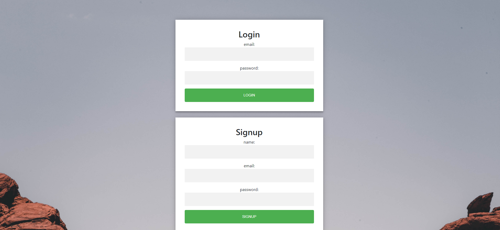
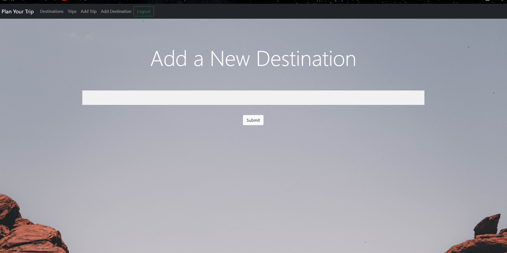
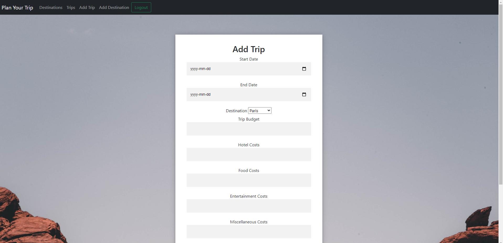
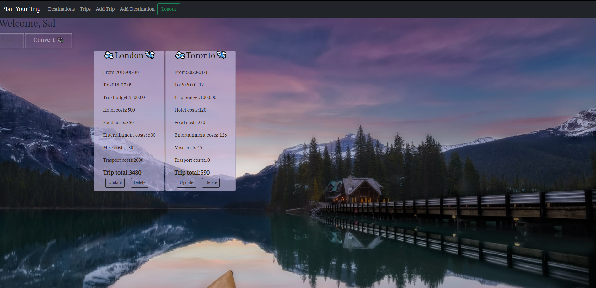
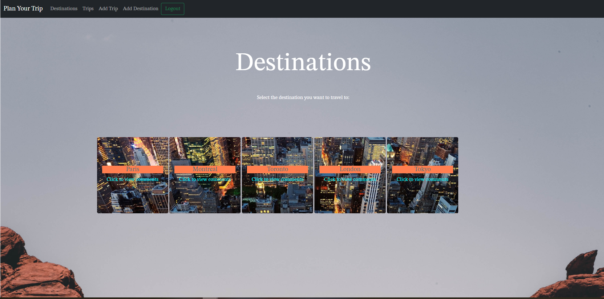

# Plan Your Trip

I want to get away, I want to fly away. - Lenny Kravitz

# Table of Contents
<h3>

*[The Team](#team)
*[The Description](#description)
*[Criteria](#criteria)
*[NPMs](#npms-used)
*[Links](#links)
*[Preview](#screenshots)

</h3>

# Team
<h3><ul>
<li><a href="https://github.com/darylnauman" target="_blank">Daryl</a></li>
<li><a href="https://github.com/gleeson-emily" target="_blank">Emily</a></li>
<li><a href="https://github.com/Staycold" target="_blank">Patrick</a></li>
<li><a href="https://github.com/ahsan13101994" target="_blank">Syed</a></li>
</ul>
</h3>

# Description
<h4> We wanted to build an app, where you can plan for, and keep track of travel expenses, and have the ability to convert into different currencies. 

We made an app that gives you the ability to create a profile, where you can add trip budget cards, update and/or delete them. You can add destinations and comment helpful hints on those destinations for other users to see. 

We delivered our original goal, but we aren't going to stop there. We hope you enjoy this first version of our app. 
</h4>

# Criteria: 
<ul>
<li> Use Node.js and Express.js to create a RESTful API.</li>

<li> Use Handlebars.js as the template engine.</li>

<li> Use MySQL and the Sequelize ORM for the database.</li>

<li> Have both GET and POST routes for retrieving and adding new data.</li>

<li> Use at least one new library, package, or technology that we haven’t discussed.</li>

<li> Have a folder structure that meets the MVC paradigm.</li>

<li> Include authentication (express-session and cookies).</li>

<li> Protect API keys and sensitive information with environment variables.</li>

<li> Be deployed using Heroku (with data).</li>

<li> Have a polished UI.</li>

<li> Be responsive.</li>

<li> Be interactive (i.e., accept and respond to user input).</li>

<li> Meet good-quality coding standards (file structure, naming conventions, follows best practices for class/id naming conventions, indentation, quality comments, etc.).</li>

<li> Have a professional README (with unique name, description, technologies used, screenshot, and link to deployed application).</li>

## NPMs used:

<ul>
<li><a href="https://www.npmjs.com/package/live-currency-exchange" target="_blank">Live-Currency-Exchange</a> </li>
<li><a href="https://www.npmjs.com/package/express" target="_blank">Express</a></li>
<li><a href="https://www.npmjs.com/package/handlebars" target="_blank">Handlebars</a></li>
<li><a href="https://www.npmjs.com/package/sequelize" target="_blank">Sequelize</a></li>
<li><a href="https://www.npmjs.com/package/session" target="_blank">Sessions</a></li>
<li><a href="https://www.npmjs.com/package/dotenv" target="_blank">dotenv</a></li>

<li><a href="https://www.npmjs.com/package/bcrypt" target="_blank">bcrypt</a></li>

<li><a href="https://www.npmjs.com/package/mysql2" target="_blank">mysql2</a></li>
</ul>

# Links:

<h5>Github:</h5>
<a href="https://github.com/darylnauman/cold-travel-planner" target="_blank">https://github.com/darylnauman/cold-travel-planner</a>

<h5>Heroku:</h5>
<a href="https://intense-savannah-61016.herokuapp.com/ " target="_blank">https://intense-savannah-61016.herokuapp.com/ </a>

 

 # Screenshots

